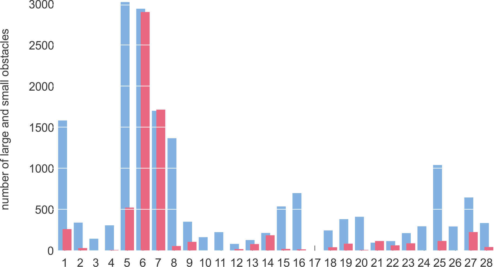
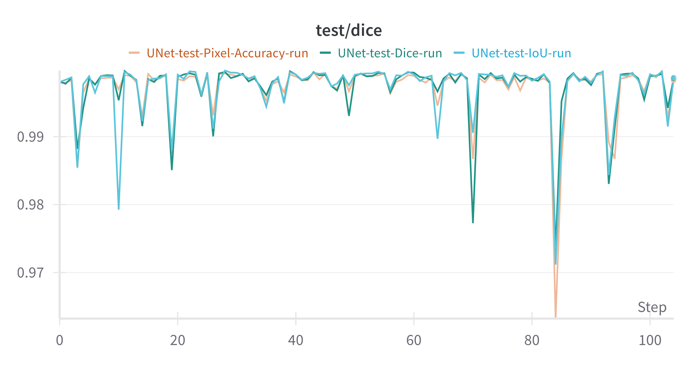

# U-Net-Water-Land-Segmentation


Figure 1: Machine learning pipeline with data preprocessing using the WaSR network [1] [10], binarization of three-segment mask and OpenCV based detection of white blobs on binarized mask for ground truth labels for evaluating the YOLOv8 model [4] on RGB images using default weights and U-Net [7] on water/land segmentation


## Abstract

Recent advancements in image segmentation methodologies have significantly impacted the navigational capabilities of unmanned surface vehicles (USVs) over maritime environments. This research delves into the formulation and performance assessment of a U-Net [7] based segmentation model trained on a specialized dataset, modeled after
the MaSTr1325 and MODD2 datasets [2] [3] but recorded on a river surface instead of the sea. The WaSR network, renowned for water segmentation and refinement in maritime obstacle detection [1] [10], was employed to extract masks from the recorded frames. Subsequently, the three-segment masks were transformed into binary masks, distinguishing water from the surroundings, forming the basis for training the U-Net segmentation model. The U-Net preformed exemplary, achieving an Intersection over Union
(IoU) score of 99.08%, a dice score of 99.73%, and pixel accuracy of 99.39%. 

Building upon the successful implementation of the U-Net segmentation model, this study further explores the potential application of the YOLOv8 [4] object detection algorithm for identifying obstacles in the navigational path of unmanned surface vehicles in river environments. Despite the initial promise of YOLOv8, its integration led to less-than-ideal outcomes, with a notable decrease in performance metrics when applied without pre-training on the dataset. Specifically, the Intersection over Union (IoU) score plummeted to 0.01%, and the dice score to 0.03%, starkly contrasting the exceptional results achieved in the segmentation task. This emphasizes the critical importance of proper fine-tuning of YOLOv8 model on domain-specific data to optimize its performance in obstacle detection scenarios. 

The overall results show unique challenges regarding segmentation and detection in river based environments.


## Runing the code

First setup your own [Weights and Biases](https://wandb.ai/site) account settings in the __.env_example__ file and rename it to __.env__ like for example:

```bash
#!/bin/bash

# Set the AI key for wandb
export WANDB_API_KEY='BMif1IPmyg8ceZGLtj3MKN3CnSQ577Pi5w6bRDD2tVIDol9OuVChkiGhNqZtmFoavgGmHLees71RMCyIqGOX2BGiLTnBQH0fQV1ZWIjd7af1KewEC5SDgWhtPaJQg2c0'
export WANDB_ENTITY='JohnDoe123'
```

After this you can edit the __runSegDet.sh__ file in the **/container** folder to enable/disable different commands/features of this project. Bellow is an example of running all possible training and testing commands.

```bash
#!/bin/bash

# Print the WAND environment variables for debugging
printenv | grep WANDB

# Prepare the sub-datasets for segmentation and detection
python3 /app/container/segmentation/run.py --prepare --resize-prepared --resize-prepared-size 512,384
python3 /app/container/detection/run.py --prepare --resize-prepared --resize-prepared-size 512,384 --autolabel --autolabel-method rawcontours
python3 /app/container/detection/run.py --prepare --resize-prepared --resize-prepared-size 512,384 --autolabel --autolabel-method autodistil

# Run segmentation
python3 /app/container/segmentation/run.py --train
python3 /app/container/segmentation/run.py --test --best-weights IoU
python3 /app/container/segmentation/run.py --test --best-weights Dice
python3 /app/container/segmentation/run.py --test --best-weights Pixel_Accuracy

# Run detection
python3 /app/container/detection/run.py --test --test-method pretrained

# The following two methods are still in development
#python3 /app/container/detection/run.py --test --test-method contours
#python3 /app/container/detection/run.py --test --test-method autodistil
```

Before running the code you might need to download the default YOLOv8 weights and place them in the **container/detection/weights** folder for the run script of the detection script to read and use them.


## Project structure

The general project structure is split in the root folder named **/container** from which we have access to 3 main components as folows:

- **/dataset folder** - Contains all raw data (__/RGB__ and __/WASR__ folders) and subseqent datasets used in segmentation (__*-seg__ format folders) and detection (__*-det__ format folders)
- **/segmentation folder** - Contains the code used to run the segmentation U-Net on the dataset with pre-preparation of the data
- **/detection folder** - Contains the code used to run the detection using YOLOv8 on the dataset with pre-preparation of the data


## Introduction

Image segmentation and detection, fundamental tasks in computer vision, play a pivotal role in enhancing the navigational capabilities of unmanned surface vehicles (From
now on USV/USVs) over diverse environments. Recent advancements in this domain have demonstrated promising outcomes, providing a basis for further exploration and refinement.

This study focuses on the development and evaluation of a U-Net based segmentation model, a neural network architecture widely recognized for its effectiveness in image segmentation tasks [7]. The model is trained on a specialized dataset crafted in alignment with the MaSTr-1325 and MODD2 datasets [2] [3], with a distinctive emphasis
on river surfaces. While maritime environments have been extensively studied, the unique challenges posed by river navigation necessitate tailored approaches to both maritime and freshwater surfaces for effective obstacle detection and path planning.

The utilization of the water segmentation and refinement network (From now on WaSR) [1] [10], acknowledged for its prowess in water segmentation and refinement in maritime obstacle detection, serves as a crucial component in this research. By extracting masks from recorded frames, the algorithm contributes to the creation of binary masks
that distinguish water from surrounding elements. These masks are then employed to train the U-Net segmentation model, which, as indicated by performance metrics, exhibits
exceptional accuracy.

Building on the success of the segmentation model, the study extends its focus to the integration of the 8th generation You Only Look Once object (From now on YOLOv8)
detection algorithm [4]. The objective is to assess its applicability for identifying obstacles in the path of USVs navigating river environments. However, preliminary results reveal sub-optimal performance, emphasizing the critical role of fine-tuning the YOLOv8 detector on domain specific data. This highlights the necessity for a nuanced understanding of the environmental context and the detection algorithm architecture in optimizing object detection capabilities for USVs.

As such there is also a need for evaluating aforementioned models using correct performance measures. As such we explore which measures fit the criteria for accurate
evaluation of our models.


## Realted work

The related works regarding segmentation and detection algorithms is split into five unique sections. First we explain the structure of two of the new large-scale maritime
semantic segmentation datasets recorded with and meant for small-scale USVs. Then we explain the WaSR [1] [10] algorithm which we used for primary data preprocessing.
Following it we delve into the architecture of both neural networks used for segmentation and detection, U-Net and YOLOv8. Finally we explore the performance measures
that fit our criteria for correctly evaluating our neural networks.


### Water-surface USV datasets

The MaSTr1325 dataset [2] is a coastal maritime dataset comprised of 1325 diverse images, that were picked with regards to various weather conditions and time of day to
ensure dataset variety, primarily designed for semantic segmentation and obstacle detection. The dataset was acquired using a small water-surface based USV recording more
than 50 hours of footage while manually driving around the coastal areas. Since this is a segmentation dataset each image or rather image pixel of the dataset is labeled with one of the four categories: obstacles or environment, water, sky and Unknown category. The dataset also offers a significant advantage in terms that all images are precisely time-synchronized with on-board GPS and IMU measurements, ensuring accurate alignment for comprehensive analysis.

<div style="display: flex; justify-content: space-around; flex-wrap: wrap;">
    
    
    
    
</div>

Figure 2: Statistics and image examples of the MaSTr1325 dataset [2]: (1) Size distribution of obstacles, (2) Average proportion of annotated pixels for each category, (3) and (4) Image examples of the dataset


Following the well structured MaSTr1325 dataset is the MODD2 dataset [3] which was developed earlier and is currently the biggest and the most challenging multi-modal
marine obstacle detection dataset for USV usage. The dataset is comprised of 28 videos of variable length spanning to 11675 stereo-frames at resolution of 1278x958 pixels each. These videos were captured within a time frame of approximately 15 months manually guiding the USV. Since this dataset is substantially bigger than the MaSTr1325
dataset it offers an even greater variety of environmental and time-based factors as well as realistic navigation scenarios like driving near an obstacle and more presence of extreme situations like sudden changes of motion, sun glitter and reflections. This dataset is labeled using box detections of obstacles separated into two classes: small obstacles (light red) and large obstacles (cyan). On top of that this dataset also has the advantage of time-synchronized frames with measurements from the GPS, IMU and compass.





Figure 3: Statistics of the MODD2 dataset [3]: (1) Size distribution of obstacles for RAW images, (2) Distribution of large (cyan) and small (light red) obstacles in each sequence for RAW images, (3) and (4) Image examples of the dataset


### Water Segmentation and Refinement network

The Water Segmentation and Refinement network (WaSR) [1] [10] developed by Bovcon et al. is a novel deep encoder-decoder architecture designed for maritime environments specifically to fix the problem of many false-positives if we were to use the conventional detectors for autonomous vehicles on ground. Infrastructure based on ResNet101 with atrous convolutions enables the extraction of rich visual features, following it the decoder gradually fuses these features with inertial information from the inertial measurement unit (IMU) on the USV. This approach significantly improves the segmentation accuracy of the water component in the presence of visual ambiguities, such as fog on the horizon. Since the approach is relatively novel it also introduces a custom loss function for semantic separation to enforce the separation of different semantic components to increase robustness. Experimental results showed that this approach out-preformed the current state-of-the-art by 4% in F1 score on a challenging dataset and with strict domain generalization improved the F1 score by 24% while showing great generalization capabilities.


Figure 4: Architecture of the WaSR network. Encoder generates deep features that are slowly fused in the decoder with an IMU feature channel improving water-edge detection and estimation. Semantic separation loss computed at the end of the encoder drives discriminative feature learning, further reducing false-positives and increasing true-positives


### U-Net

U-Net [7] is a relatively old and stable approach to the problem of image segmentation however still extremely relevant for the design of novel segmentation networks. It was developed in 2015 by a group of researchers from the CS department and BIOSS Centre for Biological Signalling Studies from University of Freiburg in Germany. This network focuses on a strong use of data augmentation instead of the common approach of using bigger annotated datasets and as such can be trained on relatively few samples because of its more efficient use of data. Since the network is relatively small it enables fast performance and can be potentially used in real-time applications. Primarily this network was developed for the medical field analysing various images and also won the ISBI cell tracking challenge 2015 by a large margin in certain categories with intersection over union (IoU) score of 92.03% on the PhC-U373 dataset (Partially annotated phase contrast microscopy images of cells) and a score of 77.56% on the DIC-HeLa dataset (Differential interference contrast microscopy images of cells recorded on flat glass) significantly improving the scores from second places of 83% (PhC-U373) and 46% (DIC-HeLa).


Figure 5: Architecture of U-Net using a contracting structure to capture context and a symmetric expanding structure that enables precise localization


### You Only Look Once version 8

The You Only Look Once model (YOLO) [6] was first introduced by Redmon et al. in year 2016 and has since then been iterated many times with the current 8th generation being the newest. The original architecture introduces a novel approach to define object detection as a regression problem to spatially separated bounding boxes and associated class probabilities. Implemented by a single neural network predicting bounding boxes and class probabilities directly from full images in one evaluation. Experiments show extremely fast performance while it does make more localization errors it makes up for it in low prediction of false positives on background. The 8th generation of the model (YOLOv8) [4] is a vastly improved version of the original with currently most prominent differences from the previous version of the model being anchor free detection speeding up Non-maxima-suppression (NMS), new convolutions reducing some of the parameter count and the overall size of tensors, and using mosaic augmentation while generally known to degrade performance if used throughout whole training process and as such should be turned off for the last 10 training epochs to enable even better final results. The whole model architecture can be seen on figure 6.


Figure 6: Architecture of the YOLOv8 model


### Image segmentation performance measures

There are many different performance meassures by which we can evaluate a model on such as true/false positives, true/false negatives, receiver operating curves (ROCs)
and its areas (ROC-AUC), precision, recall, precision recall curves (PRCs) and its areas (PRC-AUC), F-score and other. Summarized by many articles [9] [5] [8] every score is good for displaying a certain characteristic of the model, however for the task of image segmentation three of the conventionally used measures are intersection over union, dice score (Figure 7) and the regular pixel accuracy.


Figure 7: Two of the measure representations on how we calculate them using the overlap of predictions and ground truth: (1) Dice score, (2) Intersection over Union


## Methodology

In this section we present our methodology for evaluating the performance of U-Net segmentation model and YOLOv8 detection model. We first introduce a dataset on which both of the models are evaluated and then follow with a general evaluation methodology used for each model input and output.


### Used dataset

We used a dataset similar to the MaSTr1325 dataset [2] with the only difference being recorded with the USV on a river. The dataset was comprised of 2091 sequential images and its masks generated using the WaSR network described in related works. Since we wanted to execute binary segmentation for the water region and everything else we first
converted the WaSR masks in the RGB format to binarized masks in the gray-scale format. The original RGB images and gray-scale masks were then used as a basis for training
the U-Net. We split the dataset using 80% of the images for training and 20% of images for testing. The training dataset was then split further using 50% for training and 50% for validation. This amounts to 836 images for training, 836 images for validation and 419 images for testing. Following this we arrived at the problem of generating labels for the YOLOv8 detection model. Since we already generated the gray-scale binarized masks for U-Net we reused them for executing simple contour detection on them. Since we know that the biggest contour detected on any mask would be the coastal and sky region we limited the contour search to only detect the contours of maximum area of 30% of the whole mask. This yielded good results after visual inspection and as such we proceeded with the extraction of box coordinates for each mask contour detection yielding the ground truth with which we can evaluate the performance of the YOLOv8 detection model. For the final dataset of testing the pre-trained YOLOv8 model we used all of the RGB images and the generated ground truth labels for evaluation of the detections.


Figure 8: Image examples used in the dataset generation process: (1) RGB image, (2) Image segmented using the WaSR network, (3) Gray-scale binarized mask (4) Contour
detection ran on the mask to acquire graound truth for evaluating YOLOv8


### Evaluation methodology

The evaluation process for both the segmentation U-Net model and detection YOLOv8 model were mostly the same. For U-Net we trained the network and saved the best weight
combination where one of the three performance measures (Pixel accuracy, Dice score, Intersection over Union) was the best to achieve different results depending on the chosen weights. We proceeded with the testing where we re-calculated the performance measures for U-Net and got our final results. The same testing step was done for YOLOv8
with the only difference being at the end when we compared the predictions of the model with our own generated ground truth using box detections.


## Experiments

Here we present our experimental results training and testing the U-Net for the segmentation task and only testing the YOLOv8 for detection with our custom ground truth
since we used the pretrained weights of the model.


### Data preprocessing

The only data preprocessing that we did with the images is scaling and as such we implemented two kinds of scaling: proportional scaling which preserves the aspect ratio of the images and custom scaling, which resizes the image to the input dimensions.


### Experimental results

The results of training and testing U-Net and testing the pretrained YOLOv8 with custom ground truths is displayed in the table and graph bellow.

| **Network** | **Pixel accuracy** | **Dice score** | **IoU**   |
|-------------|---------------------|-----------------|-----------|
| U-Net       | 99.39%              | 99.73%          | 99.08%    |
| YOLOv8      | Not calulated       | 0.03%           | 0.01%     |

Table 1: Results for U-Net and YOLOv8


Figure 9: Training and validation loss of U-Net per epoch


Figure 10: Intersection over union of U-Net per epoch

We can see from the graphs that over the training period the loss for both training and validation data is decreasing and the IoU is increasing with logarithmic growth towards the ideal detection rate of 100%.





Figure 11: Interpolated progress of loss and performance measures of U-Net over the test dataset using three different best weights (Based on Pixel accuracy/Dice score/IoU)


Figure 12: Interpolated progress of performance meassures of YOLOv8 over the test dataset

For YOLOv8 the detected predictions are completely false, however we can see that in case that both the prediction and the ground truth are present on the picture the
probability of a high score is relatively high, however this still does not solve our initial problem.


## Conclusion

This paper presents a integration process of using commonly known segmentation and detection models for a domain-specific problem. U-Net presented extremely positive results and can as such be used for similar applications, however testing its generalization performance for a real-world problem might prove challenging. This could
be tested with a bigger and more challenging dataset like MODD2. However for the task of detection using YOLOv8 the performance was extremely bad and as such this results
highlight the importance of fine-tuning the YOLOv8 model before usage in this domain. Regarding this there are three approaches that could be explored in case of YOLOv8: first we could fine-tune the model on original RGB images with our custom ground truths, second we could train the model on RGB binarized masks with our custom ground truths (This approach however can be done with a much simpler classificator) and finaly if we are prepared to ditch our custom ground truths we could auto-label our dataset using a specialized LLM (For example GroundedSAM) and then train the YOLOv8 on the auto-labeled dataset generated by the LLM. Each of this approaches is worth exploring if we want to build a robust detection model using YOLOv8.


## References

[1] B. Bovcon and M. Kristan. Wasr–a water segmentation and refinement maritime obstacle detection network. IEEE Transactions on Cybernetics.

[2] B. Bovcon, J. Muhoviˇc, J. Perˇs, and M. Kristan. The mastr1325 dataset for training deep usv obstacle detection models. In 2019 IEEE/RSJ International Conference on
Intelligent Robots and Systems (IROS), pages 3431–3438. IEEE, 2019.

[3] B. Bovcon, J. Perˇs, M. Kristan, et al. Stereo obstacle detection for unmanned surface vehicles by imu-assisted semantic segmentation. Robotics and Autonomous Systems, 104:1–13, 2018.

[4] G. Jocher, A. Chaurasia, and J. Qiu. Ultralytics YOLO, Jan. 2023.

[5] D. M ̈uller, I. Soto-Rey, and F. Kramer. Towards a guideline for evaluation metrics in medical image segmentation. BMC Research Notes, 15(1):210, 2022.

[6] J. Redmon, S. Divvala, R. Girshick, and A. Farhadi. You only look once: Unified, real-time object detection. In Proceedings of the IEEE conference on computer vision and pattern recognition, pages 779–788, 2016.

[7] O. Ronneberger, P. Fischer, and T. Brox. U-net: Convolutional networks for biomedical image segmentation. In Medical Image Computing and Computer-Assisted Intervention–
MICCAI 2015: 18th International Conference, Munich, Germany, October 5-9, 2015, Proceedings, Part III 18, pages 234–241. Springer, 2015.

[8] A. A. Taha, A. Hanbury, and O. A. J. del Toro. A formal method for selecting evaluation metrics for image segmentation. In 2014 IEEE international conference on image processing (ICIP), pages 932–936. IEEE, 2014.

[9] Z. Wang, E. Wang, and Y. Zhu. Image segmentation evaluation: a survey of methods. Artificial Intelligence Review, 53:5637–5674, 2020.

[10] L. ˇZust and M. Kristan. Learning maritime obstacle detection from weak annotations by scaffolding. In Proceedings of the IEEE/CVF Winter Conference on Applications of Computer Vision, pages 955–964, 2022.